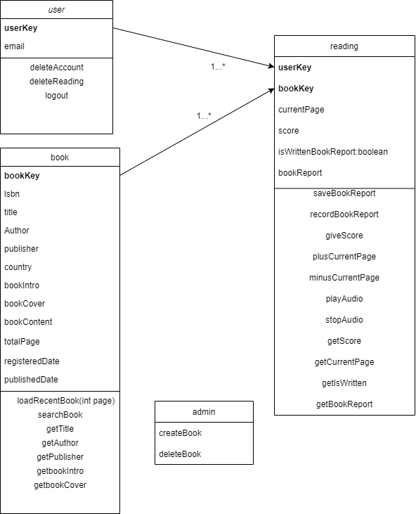

# donghwaproject!
  동화팀의 첫번째 프로젝트 입니다.
  google의 speech to text, text to speech를 이용하여 동화를 읽어주는 웹페이지를 만들어 보고자 합니다.
  저희 프로젝트의 이름은 **Liverary**입니다.

프론트 샘플
https://www.figma.com/file/1mX0J3iX3y7ePxbevfGsm0/Untitled

# Page Info
- 페이지
    - 아이덴티티 컬러정하기
    - 
    - **랜딩페이지**
        - 소셜로그인
        - 프로젝트 소개
        - (공유버튼)
        - (방문자수)
    - **홈페이지**
        - 책 검색
            - 제목, 저자
        - 로그아웃
        - 내정보 
            - 지금까지 읽은 책 및 독후감 페이지로 연결
        - 내가 읽고 있는책 리스트 표시 
            - 마지막 페이지에 도달하지 못한 경우
        - 새로 들어온 책 리스트 표시 
            - 최신순으로 표시
            - 더보기로 끝까지 열수 있도록 
    - **내정보**
        - 보관함
            - 지금까지 읽은 책
                - 책표지
                - 책 제목
                - 남긴 평점 or 평가 하러 가기
            - 독후감 쓴 책
                - 독후감 보러 가기
            - 읽는 중인 책
    - **책 소개 페이지**
        - 책 표지
        - 책 제목, 저자, 출판사, 책소개 등 소개 정보
        - 책 내용 페이지로 연결
            - 이어보기
            - 처음부터 보기
        - 독후감 쓰러가기
            - 마지막 페이지에서 연결
        - 처음부터 읽기
        - 이어읽기
    - **책 내용 페이지**
        - 책 내용
        - 진행상황 (게이지)
        - 이전 페이지
        - 다음 페이지
    - **독후감 쓰는 페이지**
        - 책 표지
        - 책 정보
        - 평점 남기기
            - 손으로 터치하면 별점 조정가능
            - 손떼면 자동 저장
        - 독후감 남기기
            - 독후감 작성 전이면 `독후감을 작성해 주세요`
            - 저장 버튼
                - 편집버튼 없이 저장하면 변경사항 저장
            - 녹음 버튼
                - 녹음표시 팝업창 
     - **관리자용 페이지**
        - 책 등록
        - 책 삭제

# DB Schema
- DB
    - **책 book**
        - 변수
            - **Long** bookKey
            - **string** ISBN
                - Nullable = false
            - **string** 책제목 title
                - Nullable = false
            - **string** 저자 author
                - Nullable = false
            - **string** 출판사 publisher
                - Nullable = false
            - **string** 나라별 country
                - Nullable = true
            - **string** 책 소개 bookIntro(글자수 제한 필요)
                - Nullable = false
            - **string** 책 표지 bookCover(이미지 링크만 저장)
                - Nullable = false
            - **string** 책 내용 bookContent
                - Nullable = false
            - **int** 전체 페이지수  totalPage
                - Nullable = false
            - **date** 등록날짜 registeredDate
                - Nullable = false
            - **date** 출간날짜 publishedDate
                - Nullable = false
        - 메서드
            - getTitle
            - getAuthor
            - getPubliser
            - getBookIntro
            - getBookCover
            - searchBook
                - 책 검색
    - **사용자 user**
        - 변수
            - **Long** userKey
            - **string** email
                - **int** 전체 페이지수 
                    - Nullable = false
                - **int** 현재 읽고 있는 페이지수
                    - 초기값 0
                    - Nullable = false
                - **int** 평점
                    - Nullable = true
            - 소셜 로그인시 필요한 키?
        - 메서드
            - getUserEmail
            - logout
                - 로그아웃
            - deleteAccount
                - 사용자 계정 삭제
            - deleteReading
                - 읽는 중인 책 삭제
            - loadRecentBook(int page)
                - 책 등록 날짜 별로 정렬된 상태에서 (page-1)*==4==번째 책부터 ==4개== 뽑기
    - **읽는중인 책 reading**
        - == 한페이지당 글자수 제한 = 300 ==
        - 변수
            - **Long** userKey
            - **Long** bookKey
            - **int** 현재 읽고 있는 페이지수 currentPage
                - 초기값 1
                - Nullable = false
            - **int** 평점 score 
                - 최대 5
                - Nullable = true
            - **boolean** 독후감 여부 isWrittenBookReport
                - 초기값 false
            - **string** 독후감 내용 bookReport
                - 글자수 제한 필요
                - Nullable = true
        - 메서드
            - getScore
            - getCurrentPage
            - getIsWrittenBookReport
            - getBookReport
            - saveBookReport
                - 독후감쓰기
            - recordBookReport
                - 독후감 녹음하기
                - API연결 필요
                - 목소리를 텍스트로 바꾼후 saveBookReport 호출
            - plusCurrentPage
                - 이전페이지로
                - 전체 텍스트에서 제한된 글자수만큼 이동
            - minusCurrentPage
                - 다음페이지로
            - PlayAudio
                - currentPage부터 음서읽기 시작
            - stopAudio
                - 음성 정지
                - stopAudio이후 다시 재생 누르면 currentPage의 시작 부분부터 재생됨
            - giveScore
                - 별점주기
    - **관리자 admin**
        - 변수
        - 메서드
            - createBook
            - deleteBook
 
# Class Diagram

